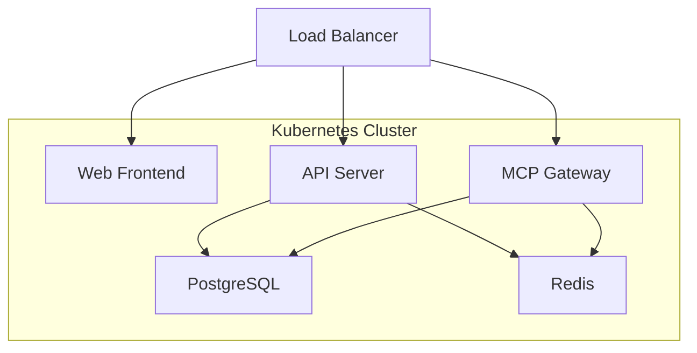

<Warning>
**文档补充中...**

Kubernetes 部署文档正在完善中。如果您想帮忙完善这部分内容，欢迎向项目贡献！
</Warning>

## 部署概述

MCP Gateway 支持在 Kubernetes 集群中部署，适合大规模生产环境使用。K8s 部署具有以下优势：

<CardGroup cols={3}>
  <Card title="高可用性" icon="shield-check">
    支持多副本部署，自动故障恢复
  </Card>
  <Card title="弹性伸缩" icon="chart-line">
    根据负载自动调整实例数量
  </Card>
  <Card title="服务发现" icon="network-wired">
    自动服务注册和负载均衡
  </Card>
</CardGroup>

## 部署架构

推荐使用微服务架构进行 K8s 部署：



## 快速开始

### 前置要求

- Kubernetes 集群 (v1.20+)
- kubectl 命令行工具
- Helm (可选，推荐)

### 使用 kubectl 部署

<Steps>
  <Step title="创建命名空间">
    ```bash
    kubectl create namespace mcp-gateway
    ```
  </Step>

  <Step title="部署数据库">
    ```bash
    # PostgreSQL
    kubectl apply -f https://raw.githubusercontent.com/amoylab/unla/main/deploy/k8s/postgres.yaml -n mcp-gateway

    # Redis
    kubectl apply -f https://raw.githubusercontent.com/amoylab/unla/main/deploy/k8s/redis.yaml -n mcp-gateway
    ```
  </Step>

  <Step title="配置 ConfigMap 和 Secret">
    ```bash
    kubectl apply -f https://raw.githubusercontent.com/amoylab/unla/main/deploy/k8s/configmap.yaml -n mcp-gateway
    kubectl apply -f https://raw.githubusercontent.com/amoylab/unla/main/deploy/k8s/secret.yaml -n mcp-gateway
    ```
  </Step>

  <Step title="部署应用服务">
    ```bash
    kubectl apply -f https://raw.githubusercontent.com/amoylab/unla/main/deploy/k8s/mcp-gateway.yaml -n mcp-gateway
    kubectl apply -f https://raw.githubusercontent.com/amoylab/unla/main/deploy/k8s/apiserver.yaml -n mcp-gateway
    kubectl apply -f https://raw.githubusercontent.com/amoylab/unla/main/deploy/k8s/web.yaml -n mcp-gateway
    ```
  </Step>
</Steps>

### 使用 Helm 部署

<Steps>
  <Step title="添加 Helm 仓库">
    ```bash
    helm repo add unla https://amoylab.github.io/unla-helm-charts
    helm repo update
    ```
  </Step>

  <Step title="自定义配置">
    创建 `values.yaml` 文件：
    ```yaml
    global:
      storageClass: "fast-ssd"

    postgresql:
      enabled: true
      auth:
        postgresPassword: "your-postgres-password"
        database: "mcp-gateway"

    redis:
      enabled: true
      auth:
        password: "your-redis-password"

    mcpGateway:
      replicaCount: 3
      resources:
        requests:
          memory: "512Mi"
          cpu: "500m"
        limits:
          memory: "1Gi"
          cpu: "1000m"

    apiserver:
      replicaCount: 2

    ingress:
      enabled: true
      className: "nginx"
      hosts:
        - host: mcp-gateway.example.com
          paths:
            - path: /
              pathType: Prefix
    ```
  </Step>

  <Step title="安装应用">
    ```bash
    helm install mcp-gateway unla/mcp-gateway \
      --namespace mcp-gateway \
      --create-namespace \
      --values values.yaml
    ```
  </Step>
</Steps>

## 配置说明

### 环境变量

主要配置通过 ConfigMap 和 Secret 管理：

<AccordionGroup>
  <Accordion icon="gear" title="ConfigMap 配置">
    - 数据库连接信息
    - Redis 连接信息
    - 服务端口配置
    - 日志级别设置
  </Accordion>

  <Accordion icon="lock" title="Secret 配置">
    - 数据库密码
    - Redis 密码
    - JWT 密钥
  </Accordion>
</AccordionGroup>

### 持久化存储

建议为数据库配置持久化存储：

```yaml
apiVersion: v1
kind: PersistentVolumeClaim
metadata:
  name: postgres-pvc
spec:
  accessModes:
    - ReadWriteOnce
  resources:
    requests:
      storage: 20Gi
  storageClassName: fast-ssd
```

## 监控和日志

### Prometheus 监控

MCP Gateway 暴露 Prometheus 指标，可通过以下配置进行监控：

```yaml
apiVersion: monitoring.coreos.com/v1
kind: ServiceMonitor
metadata:
  name: mcp-gateway
spec:
  selector:
    matchLabels:
      app: mcp-gateway
  endpoints:
  - port: metrics
    path: /metrics
```

### 日志收集

推荐使用 ELK 或 Loki 进行日志收集：

```yaml
apiVersion: v1
kind: ConfigMap
metadata:
  name: fluent-bit-config
data:
  fluent-bit.conf: |
    [INPUT]
        Name tail
        Path /var/log/containers/*mcp-gateway*.log
        Parser docker
        Tag kube.mcp-gateway.*
```

## 故障排查

### 常见问题

<AccordionGroup>
  <Accordion icon="exclamation-triangle" title="Pod 启动失败">
    检查 ConfigMap 和 Secret 配置是否正确：
    ```bash
    kubectl describe pod <pod-name> -n mcp-gateway
    kubectl logs <pod-name> -n mcp-gateway
    ```
  </Accordion>

  <Accordion icon="database" title="数据库连接问题">
    验证数据库服务和连接配置：
    ```bash
    kubectl get svc -n mcp-gateway
    kubectl exec -it <pod-name> -n mcp-gateway -- nc -zv postgres 5432
    ```
  </Accordion>

  <Accordion icon="network-wired" title="服务间通信问题">
    检查 Service 和网络策略：
    ```bash
    kubectl get svc,endpoints -n mcp-gateway
    kubectl describe networkpolicy -n mcp-gateway
    ```
  </Accordion>
</AccordionGroup>

## 贡献指南

<Info>
我们欢迎社区贡献完善 Kubernetes 部署文档和配置文件！如果您有经验或建议，请：

1. 访问 [GitHub 项目](https://github.com/amoylab/unla)
2. 提交 Issue 或 Pull Request
3. 分享您的部署经验

您的贡献将帮助更多用户顺利在 K8s 环境中部署 MCP Gateway！❤️
</Info>