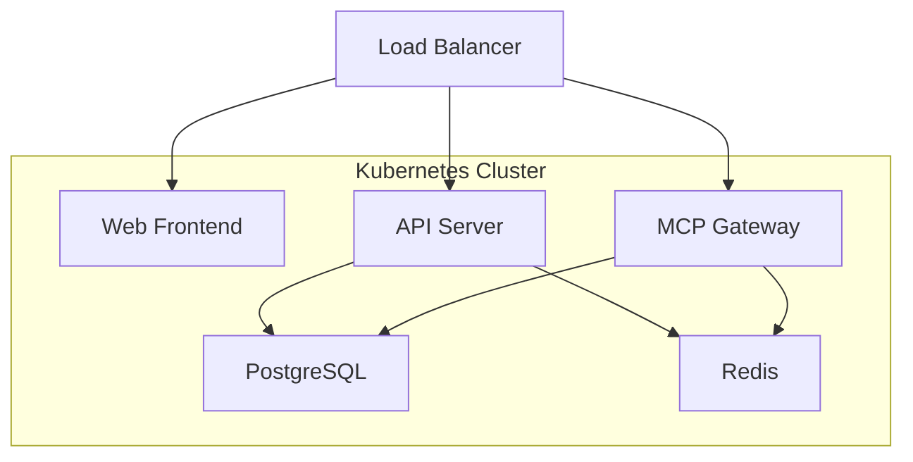

## 部署概述

MCP Gateway 支持在 Kubernetes 集群中部署，适合大规模生产环境使用。K8s 部署具有以下优势：

<CardGroup cols={3}>
  <Card title="高可用性" icon="shield-check">
    支持多副本部署，自动故障恢复
  </Card>
  <Card title="弹性伸缩" icon="chart-line">
    根据负载自动调整实例数量
  </Card>
  <Card title="服务发现" icon="network-wired">
    自动服务注册和负载均衡
  </Card>
</CardGroup>

## 部署架构

推荐使用微服务架构进行 K8s 部署：



## 快速开始

### 使用 kubectl 部署

<Steps>
  <Step title="下载部署文件">
    从 GitHub 下载所有 K8s 相关的部署文件：
    ```bash
    # 克隆项目或下载部署文件目录
    git clone https://github.com/AmoyLab/Unla.git
    cd Unla/deploy/k8s/multi
    ```
  </Step>

  <Step title="创建命名空间">
    ```bash
    kubectl apply -f .
    ```
  </Step>

  <Step title="部署依赖服务">
    ```bash
    # 部署数据库等依赖服务
    kubectl apply -f deps
    ```
  </Step>

  <Step title="部署应用基础服务">
    ```bash
    # 部署核心应用服务
    kubectl apply -f base
    ```
  </Step>

  <Step title="部署网关服务 (二选一)">
    根据您的环境选择合适的网关：

    **使用 Traefik:**
    ```bash
    kubectl apply -f traefik
    ```

    **或使用 Nginx Ingress:**
    ```bash
    kubectl apply -f ingress
    ```
  </Step>
</Steps>

<Note>
此部署方式支持多副本高可用部署，其他更多自定义配置可在下载的 YAML 文件中自行调整。
</Note>

## 故障排查

### 常见问题

<AccordionGroup>
  <Accordion icon="sliders" title="Pod 启动失败">
    检查 ConfigMap 和 Secret 配置是否正确：
    ```bash
    kubectl describe pod <pod-name> -n mcp-gateway
    kubectl logs <pod-name> -n mcp-gateway
    ```
  </Accordion>

  <Accordion icon="database" title="数据库连接问题">
    验证数据库服务和连接配置：
    ```bash
    kubectl get svc -n mcp-gateway
    kubectl exec -it <pod-name> -n mcp-gateway -- nc -zv postgres 5432
    ```
  </Accordion>

  <Accordion icon="network-wired" title="服务间通信问题">
    检查 Service 和网络策略：
    ```bash
    kubectl get svc,endpoints -n mcp-gateway
    kubectl describe networkpolicy -n mcp-gateway
    ```
  </Accordion>
</AccordionGroup>

## 贡献指南

<Info>
我们欢迎社区贡献完善 Kubernetes 部署文档和配置文件！如果您有经验或建议，请：

1. 访问 [GitHub 项目](https://github.com/amoylab/unla)
2. 提交 Issue 或 Pull Request
3. 分享您的部署经验

您的贡献将帮助更多用户顺利在 K8s 环境中部署 MCP Gateway！❤️
</Info>