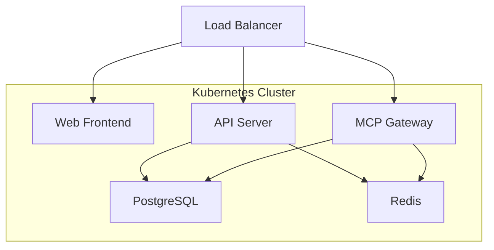

## Deployment Overview

MCP Gateway supports deployment in Kubernetes clusters, suitable for large-scale production environments. K8s deployment has the following advantages:

<CardGroup cols={3}>
  <Card title="High Availability" icon="shield-check">
    Supports multi-replica deployment with automatic failover
  </Card>
  <Card title="Elastic Scaling" icon="chart-line">
    Automatically adjusts instance count based on load
  </Card>
  <Card title="Service Discovery" icon="network-wired">
    Automatic service registration and load balancing
  </Card>
</CardGroup>

## Deployment Architecture

Recommended to use microservice architecture for K8s deployment:



## Quick Start

### Deploy with kubectl

<Steps>
  <Step title="Download Deployment Files">
    Download all K8s related deployment files from GitHub:
    ```bash
    # Clone project or download deployment file directory
    git clone https://github.com/AmoyLab/Unla.git
    cd Unla/deploy/k8s/multi
    ```
  </Step>

  <Step title="Create Namespace">
    ```bash
    kubectl apply -f .
    ```
  </Step>

  <Step title="Deploy Dependency Services">
    ```bash
    # Deploy database and other dependency services
    kubectl apply -f deps
    ```
  </Step>

  <Step title="Deploy Application Base Services">
    ```bash
    # Deploy core application services
    kubectl apply -f base
    ```
  </Step>

  <Step title="Deploy Gateway Service (Choose One)">
    Choose the appropriate gateway based on your environment:

    **Using Traefik:**
    ```bash
    kubectl apply -f traefik
    ```

    **Or using Nginx Ingress:**
    ```bash
    kubectl apply -f ingress
    ```
  </Step>
</Steps>

<Note>
This deployment method supports multi-replica high availability deployment. Other custom configurations can be adjusted in the downloaded YAML files.
</Note>

## Troubleshooting

### Common Issues

<AccordionGroup>
  <Accordion icon="sliders" title="Pod Startup Failure">
    Check if ConfigMap and Secret configurations are correct:
    ```bash
    kubectl describe pod <pod-name> -n mcp-gateway
    kubectl logs <pod-name> -n mcp-gateway
    ```
  </Accordion>

  <Accordion icon="database" title="Database Connection Issues">
    Verify database service and connection configuration:
    ```bash
    kubectl get svc -n mcp-gateway
    kubectl exec -it <pod-name> -n mcp-gateway -- nc -zv postgres 5432
    ```
  </Accordion>

  <Accordion icon="network-wired" title="Inter-Service Communication Issues">
    Check Service and network policies:
    ```bash
    kubectl get svc,endpoints -n mcp-gateway
    kubectl describe networkpolicy -n mcp-gateway
    ```
  </Accordion>
</AccordionGroup>

## Contribution Guide

<Info>
We welcome community contributions to improve Kubernetes deployment documentation and configuration files! If you have experience or suggestions, please:

1. Visit the [GitHub project](https://github.com/amoylab/unla)
2. Submit Issues or Pull Requests
3. Share your deployment experience

Your contributions will help more users successfully deploy MCP Gateway in K8s environments! ❤️
</Info>